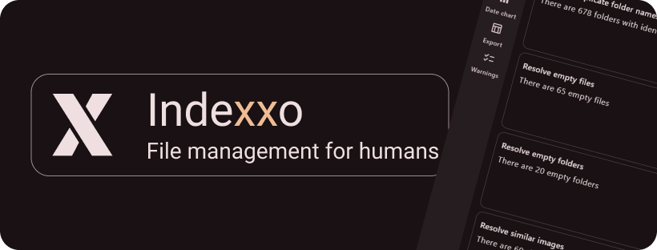
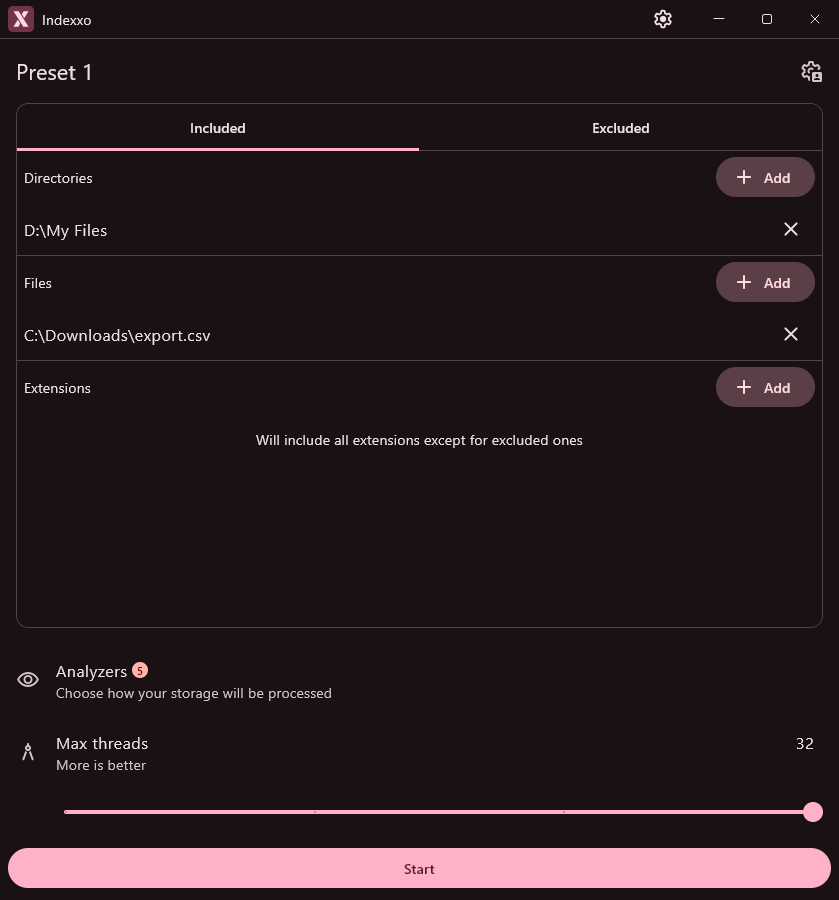
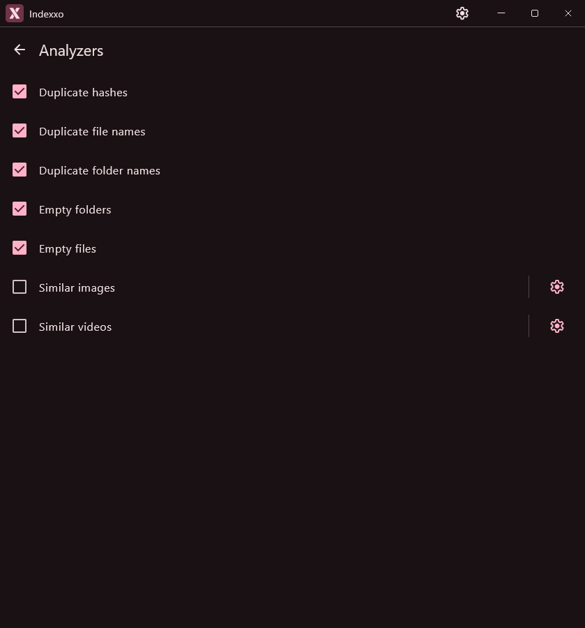
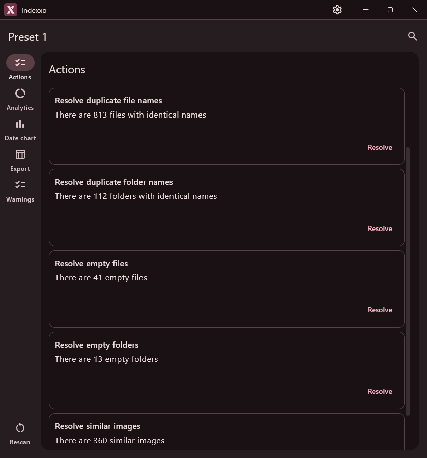
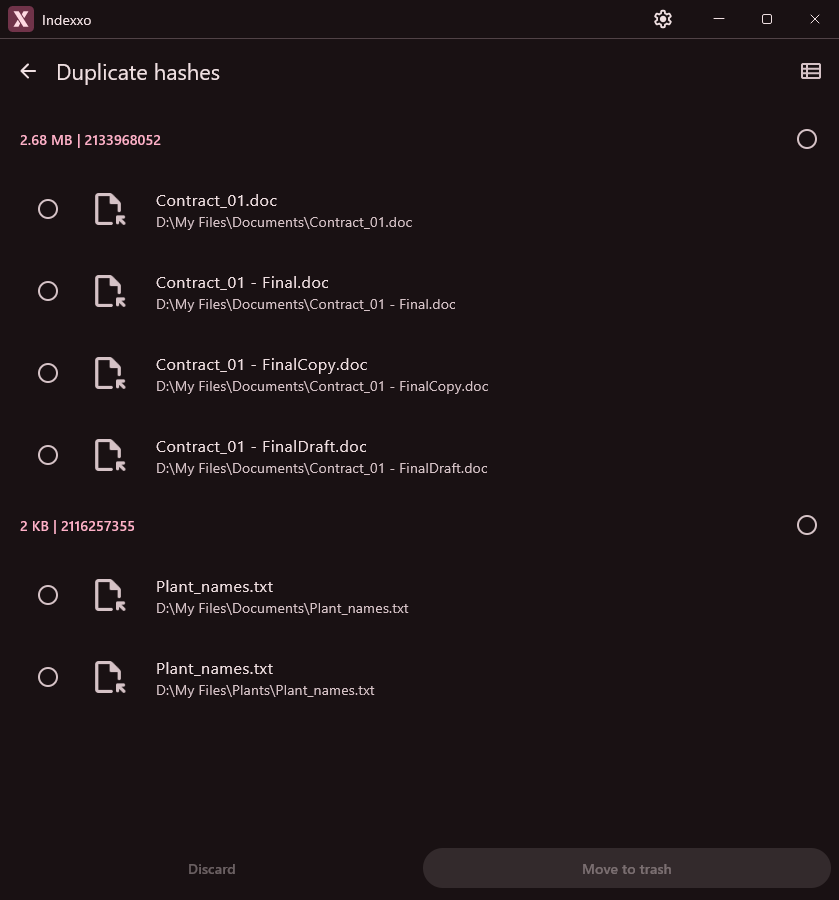
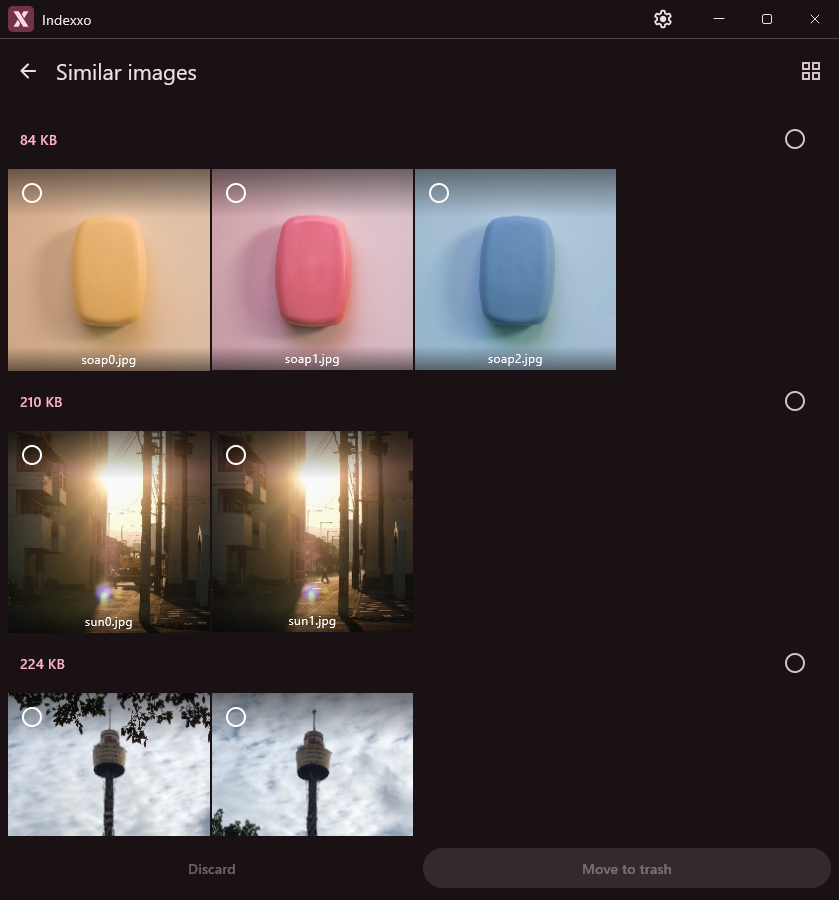

    

> [!NOTE]
> Current stage: **Open Alpha**.
>
> Most likely will work your computer

# 💻 Download

    
    

\* demo is a web app, no download required

> [!NOTE]
> Currently releasing only for Windows
> 
> Linux is supported, but not tested (you can build it yourself)
> macOS is partially supported (you can't build it)

# 😎 Features

  
📷 Screenshots

    

        
        
        
        
        
    

- Hash duplicates
- Name duplicates
- Empty files
- Empty folders
- Similar images
- Similar videos
- Similar audio (planned)
- Similar text (planned)
- Files and folders comparison (planned)
- Ability to save and switch settings presets
- Storage analytics
- Data export

# 💁‍♀️ Contribute

Please read [Contributing guidelines](./CONTRIBUTING.md)

    
    
    

# 📄 Additional

## 🎯 Targets

Indexxo ~~works on my machine~~ aims to work best on a specific set of platforms. Other platforms should also work, but
I will not be able to provide a proper support.

| Platform          | Status          | Info                                                      |
|-------------------|-----------------|-----------------------------------------------------------|
| Windows 10 (22H2) | Full support    | All features. Primary development platform                |
| Windows 11 (24H2) | Full support    | All features. Primary test platform                       |
| Ubuntu 24.04 LTS  | Partial support | All features. Issues on this platform have lower priority |
| macOS (???)       | Planned         | Never built/tested. Theoretical support                   |

## 🙏 Acknowledgements

- PDQHash (including Java implementation and test files): https://github.com/facebook/ThreatExchange
- File extensions list: https://github.com/dyne/file-extension-list
- Windows toolbar (with modifications): https://github.com/Konyaco/compose-fluent-ui/pull/57
- Material Symbols: https://fonts.google.com/icons
- Valkyrie: https://github.com/ComposeGears/Valkyrie

## 🤓 Licenses

- [Libraries](./composeApp/include/common/third-party.html)
- [PDQHash (including test files)](./composeApp/src/desktopMain/kotlin/pdqhashing/LICENSE)
- [Windows toolbar improvements](https://github.com/Konyaco/compose-fluent-ui/blob/293d7ab02d80fb9fdd372826fdc0b42b1d6e0019/LICENSE)
- [Additional test images](./composeApp/testDirs/analyzeSimilarImagesTest/README.md)

## 🔗 Useful links

- [Help](https://sadellie.github.io/indexxo/help/)
- [Privacy policy](https://sadellie.github.io/indexxo/privacy/)
- [Terms and conditions](https://sadellie.github.io/indexxo/terms/)
- [Press kit](https://sadellie.github.io/indexxo/press-kit/)
- [Roadmap](https://github.com/users/sadellie/projects/4/)
- [Milestones](https://github.com/sadellie/indexxo/milestones/)
